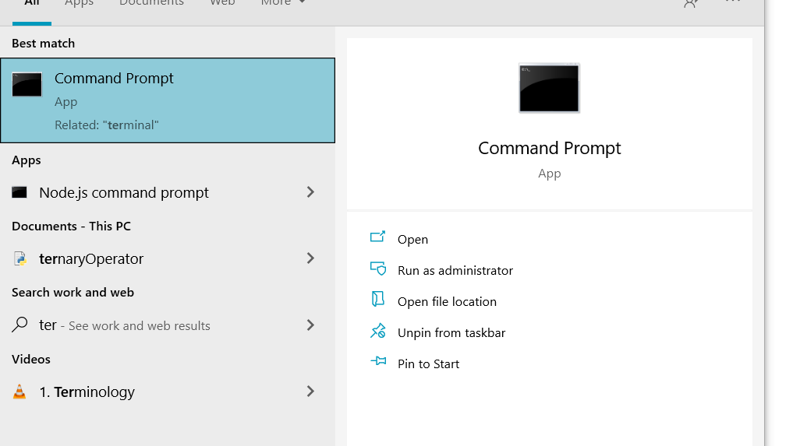
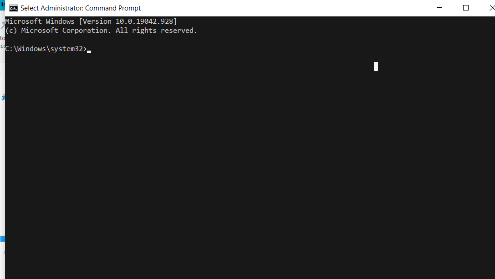
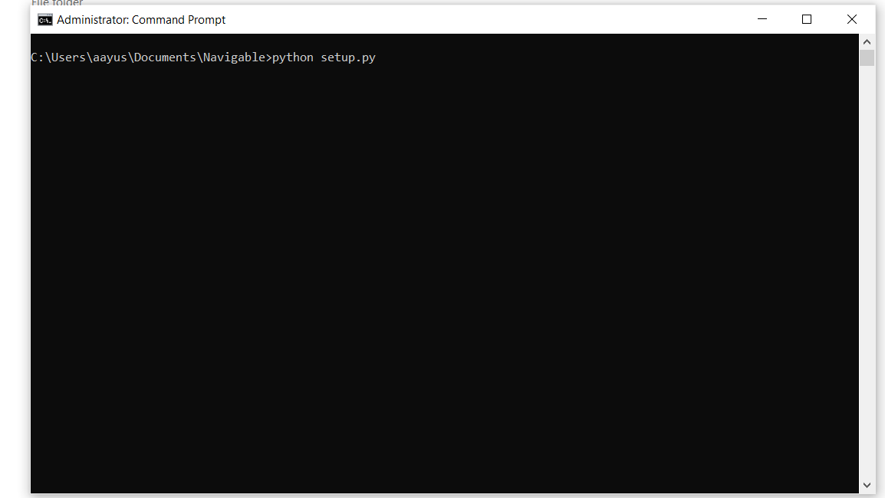
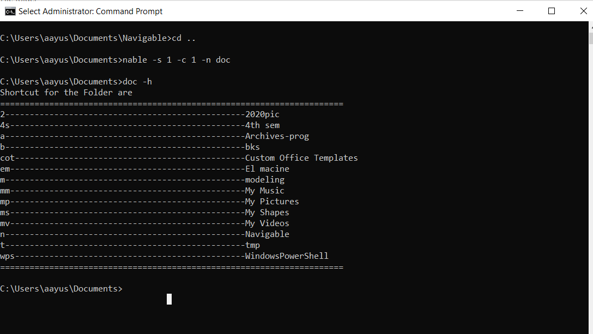
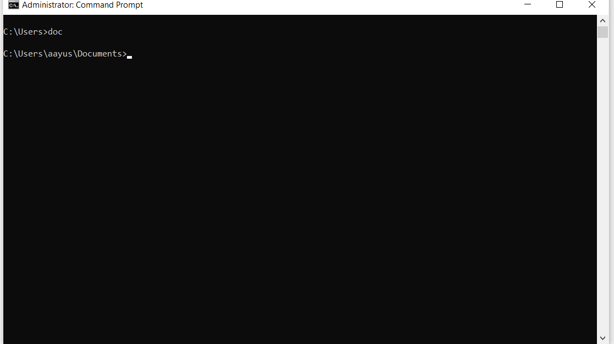
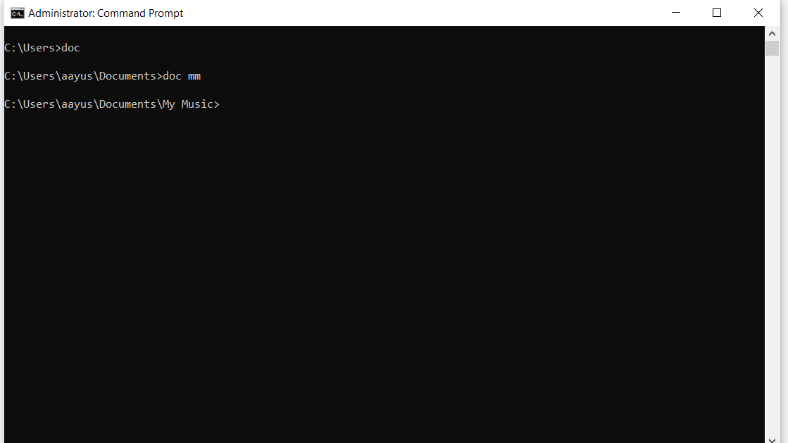
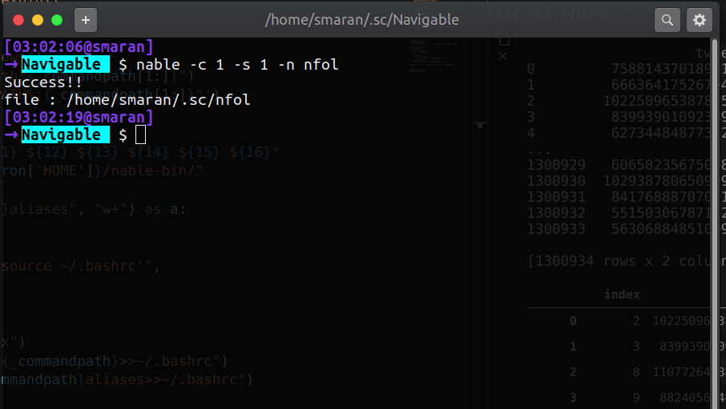

<!-- @format -->

# About

This is a simple script, to help you aid navigating the folders from terminal effordlessly.

This script, create a command for each folder, so that you can jump to that folder just by typing its command.

Here command is simple acronym you give while creating a folder as
naviagable.

# Setup (Windows)

### 1. Open the command prompt in ADMINISTRATIVE mode

_Note:- Admin console is require because we have to add the location of commands in PATH so its important._

Also note, after installation you can use regular command prompt to create jump commands.



Like this....



### 2. Run SETUP file

Then go to the Directory inside the Downloaded File.
Here its inside `../Documents/Navigable`

And then enter the command as follow. [Note your system should have python installed and should be in `PATH` (Obviously!)]



If it show message as below then we are good.


## Usage:

Script has couple of options you can view its usage with .

```bash

nable -h # or nable --help

```

Most basics one is --name.
This script not only allows you to go to different directory in terminal but also
open those directory in application like `File Manager` and `VS Code`


### Setting first shortcut to navigate a folder from terminal

```bash
nable -s 1 -c 1 -n doc
# here
# -s 1 mean enabling option to open the folder in FileExplorer
# -c 1 mean enabling option to open the folder in VSCode
# -n doc means setting the command name 'doc'
```



Now by just typing 'doc' in command prompt you can jump to Documents folder.

```bash

# jumping to Documents
c:/> doc
#jumping to Documents and Opening in File Explorer
c:/> doc s
#jumping to Documnts and Opening in VS Code
c:/> doc c


```



You can also navigate to Children Folder from command

```bash

# jumping to Documents/My Music
c:/> doc mm
#jumping to Documents/My Music and Opening in File Explorer
c:/> doc mm s
#jumping to Documents/My Music and Opening in VS Code
c:/> doc mm c


```



# Setup (Linux)

**_Note:-All the operations are exactly same as windows_**

1. Open terminal and navigate to downloaded files
2. Run command `python setup.py`
3. Update Bashrc `source ~/.bashrc`
4. You are in Business!

## Usage

### Run 'nable' Command (Navigable)



### Update ~/.bashrc

**Now after executing the nable command your have to update the ~/.bashrc each time**

_Note:- First time of executing nable command you have to update traditional way i.e
`source ~/.bashrc`
after that you can use **alias** `uprc` aka update ~/.bashrc
(alias is set automatically at setup process)_


After that you are all set,
All the features are same as that of windows.


# Uninstalling 
To remove the folder you just have to delete folder containing 
scritps.

### Windows
Open the command prompt enter following command.

```
rmdir C:\nable-bin 
```

### Linux
Open a terminal enter following command

```
rm ~/nable-bin -r -f
```
